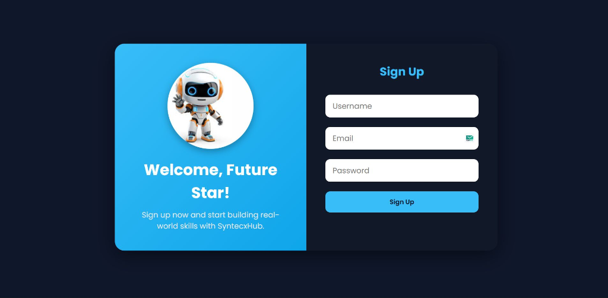

<div align="center">
  <h1>SyntecxHub Authentication System</h1>
  <p><b>A complete, secure authentication backend featuring user registration, login, JWT-based sessions, and encrypted data storage.</b></p>
  
  
  
  
  
</div>

---

## Overview

Designed and implemented a complete authentication system with signup and login using email/username and password. The system prioritizes security by utilizing **bcrypt** for password hashing, **JSON Web Tokens (JWT)** for session-free authentication, and strict middleware controls to protect sensitive routes. It gracefully handles token expiration, missing credentials, and invalid login attempts.

---

## Architecture & Workflow

The authentication flow utilizes HTTP-only cookies to securely transmit JWTs between the client and server, preventing XSS vulnerabilities. 

### 1. Registration Flow (Sign Up)
1. User submits `username`, `email`, and `password`.
2. The server queries MongoDB to ensure the username or email is not already registered.
3. **bcrypt** hashes the password with a salt round of 10.
4. The user record is saved to the database.
5. Upon success, the user is redirected to the `/syntecxhub` dashboard.

### 2. Authentication Flow (Login)
1. User submits `email` and `password`.
2. The server verifies the email exists.
3. **bcrypt** compares the submitted plaintext password against the stored hash.
4. If verified, a **JWT** is signed using a secret key, with an expiration time of 1 hour.
5. The JWT is embedded into an `HttpOnly` cookie and sent to the client.
6. The user is redirected to the `/syntecxhub` dashboard.

### 3. Route Protection Middleware
1. Protected routes invoke the `verifyToken` middleware before rendering.
2. The middleware extracts the `token` from the incoming request cookies.
3. If the token is missing, expired, or tampered with, access is immediately denied (`401 Unauthorized`).
4. If valid, the decoded user payload is attached to the request object for downstream use.

---

## User Interfaces

### Signup View


### Login View


*(Note: Ensure your screenshots are placed in the `/assets/` folder to render correctly.)*

---

## Installation & Setup

```bash
# 1. Clone the repository
git clone https://github.com/KOTHAVIVEK55/Backend-task2-.git
cd Backend-task2-

# 2. Install dependencies
npm install

# 3. Environment Variables
# Create a .env file with the following:
PORT=3000
db_url=mongodb+srv://<your_database_url>
JWT_SECRET=<your_secure_random_string>

# 4. Run the application
npm start
```

## Security Measures Implemented
* **Password Hashing:** Plaintext passwords never touch the database.
* **Stateless Auth:** JWT eliminates the need for server-side session memory.
* **HttpOnly Cookies:** Prevents client-side scripts (JavaScript) from accessing the session token.
* **Graceful Error Handling:** Generic "Invalid credentials" messages prevent user enumeration attacks.
